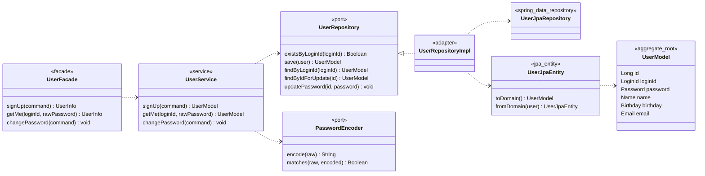
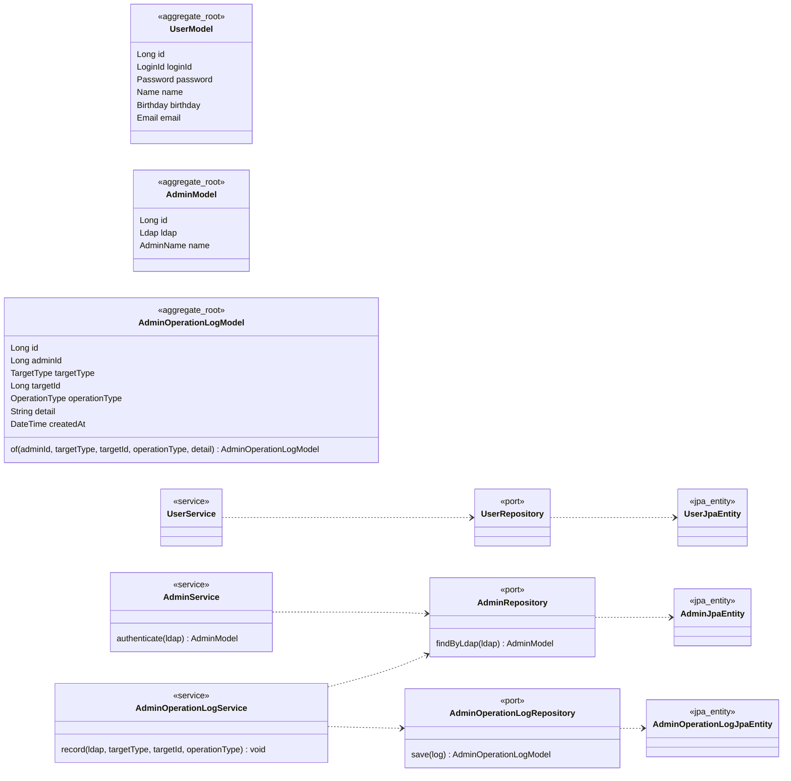
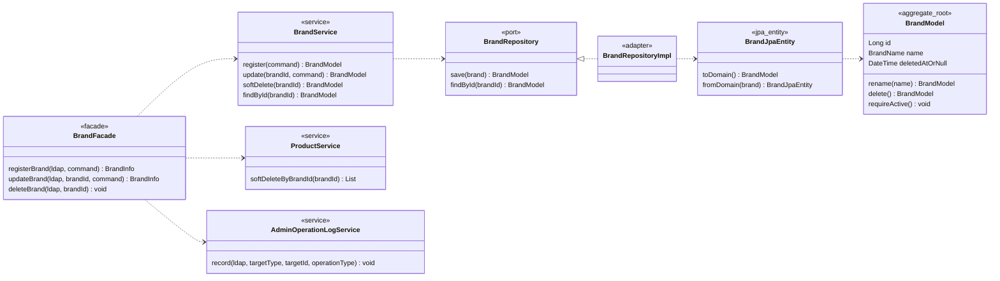
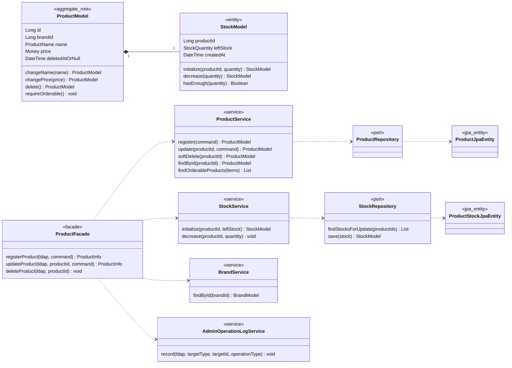
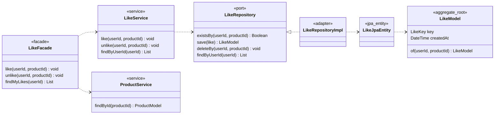
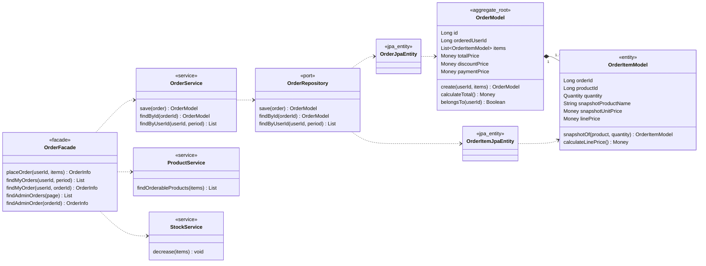
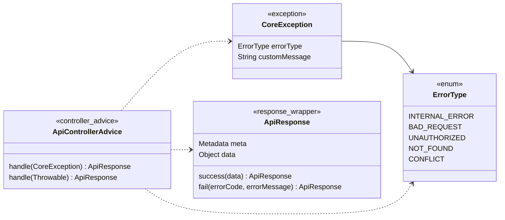
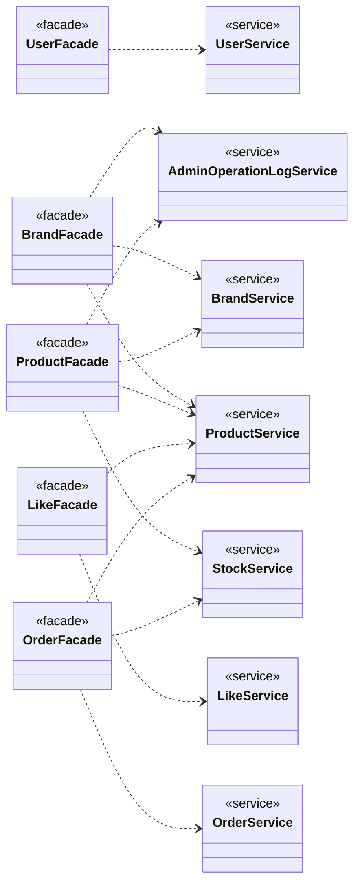

# Class Diagram

## 설계 의도

이 문서는 `01-requirements.md`와 `04-erd.md`를 기준으로 한 목표 정적 구조를 정리한다.
현재 구현된 user 도메인은 패턴 템플릿으로 사용하고, 미구현 도메인은 같은 패키지/계층 규칙을 적용한 목표 설계로 표현한다.
특히 이 문서의 목적은 컨트롤러/DB 테이블 목록이 아니라 **도메인 객체가 어떤 값을 갖고, 어떤 불변식을 지키며, 어떤 행위를 책임지는지**를 드러내는 것이다.

기준은 다음과 같다.

- 문서 기준 엔드포인트와 컬럼명은 `01-requirements.md`, `04-erd.md`를 우선한다.
- 현재 user 구현과 문서 기준이 다른 부분은 구현이 나중에 맞춰야 할 차이로 본다.
- DDD 도메인 모델은 POJO로 유지하고, JPA Entity는 `infrastructure/persistence`에서 분리한다.
- 도메인 간 협력은 Facade가 조합한다. Service끼리는 직접 의존하지 않는다.
- 자기 도메인의 영속성/외부 협력은 port + adapter로 분리한다.
- 클래스 다이어그램의 메서드는 구현 상세가 아니라 도메인 객체가 책임져야 할 행위와 규칙의 위치를 뜻한다.
- Value Object 는 별도 클래스 박스로 그리지 않는 것을 기본으로 한다. 도메인 속성에 해당하는 VO 는 소속 모델의 필드 타입으로 표기해 시각적 잡음을 줄이고, 각 도메인 절 하단에 사용된 VO 목록과 책임을 정리한다.

## 패턴 템플릿

현재 user 도메인에서 확인한 기본 슬롯이다.

| 슬롯 | 책임 |
| --- | --- |
| `model` | 애그리거트 루트/엔티티 POJO |
| `vo` | 값 객체와 도메인 규칙 검증 |
| `port` | 자기 도메인 인프라/외부 협력 추상화 |
| `application` | Service, Facade, command/info DTO |
| `infrastructure/persistence` | JPA Entity, Spring Data Repository, port 구현체 |
| `exception` | 도메인 예외 |
| `presentation` | Controller, API spec, request/response, auth resolver |

단일 도메인 변경은 Service에 트랜잭션을 둔다. 주문/관리자 변경 로그처럼 여러 도메인 상태를 함께 바꾸는 유스케이스는 Facade가 트랜잭션 경계를 가진다.

## 도메인 객체 표기 기준

다이어그램에서 도메인 설계 판단은 다음 순서로 읽는다.

| 표기 | 의미 |
| --- | --- |
| `<<aggregate_root>>` | 외부에서 직접 식별하고 저장/조회하는 일관성 경계의 루트 |
| `<<entity>>` | 루트 생명주기에 종속되지만 고유 식별 또는 상태 변경을 갖는 도메인 객체 |
| `<<value_object>>` | 값 자체와 검증 규칙을 함께 갖는 불변 객체 |
| `<<port>>` | 도메인/애플리케이션이 필요로 하는 저장소 또는 외부 협력 추상화 |
| `<<jpa_entity>>` | DB 매핑 전용 객체. 도메인 객체와 다른 개념이며 변환 경계에만 위치 |

- 도메인 객체의 필드는 비즈니스 언어 기준의 값이다. DB 컬럼명과 1:1로 맞추기보다 불변식 표현을 우선한다.
- 도메인 객체의 메서드는 `Service`에 흩어지면 안 되는 핵심 규칙을 나타낸다. 실제 구현에서는 mutable 방식과 immutable copy 방식 중 Kotlin 코드 스타일에 맞게 선택한다.
- 다른 애그리거트를 직접 참조하지 않고 식별자(`userId`, `brandId`, `productId`)로 참조한다. 존재 검증과 다중 도메인 조합은 Facade에서 수행한다.
- `createdAt`, `updatedAt`, `deletedAt`은 기본적으로 영속성 관심사다. 다만 삭제 여부, 주문 시점 스냅샷처럼 도메인 규칙에 영향을 주는 값은 도메인 모델에도 드러낸다.

## 도메인 객체 설계 요약

| 도메인 | 루트/엔티티 | 핵심 VO | 보장해야 할 불변식 | 주요 행위 |
| --- | --- | --- | --- | --- |
| User | `UserModel` | `LoginId`, `Password`, `Name`, `Birthday`, `Email` | 로그인 ID 형식/유일성, 비밀번호 형식/생년월일 포함 금지/인코딩 보관, 생년월일 과거 날짜 | 회원가입, 인증, 비밀번호 변경 |
| Admin | `AdminModel`, `AdminOperationLogModel` | `Ldap`, `AdminName`, `TargetType`, `OperationType` | 관리자 LDAP 유일성, 로그 대상은 브랜드/상품 변경 작업으로 제한 | 관리자 식별, 변경 작업 기록 |
| Brand | `BrandModel` | `BrandName` | 브랜드명 유효성, 삭제된 브랜드는 상품 등록 기준이 될 수 없음 | 등록, 이름 변경, soft delete |
| Product | `ProductModel`, `StockModel` | `ProductName`, `Money`, `Quantity`, `StockQuantity` | 상품은 존재하는 브랜드에 속함, 가격은 음수 불가, 재고는 음수 불가, 삭제된 상품은 주문 불가 | 상품 정보 변경, 삭제, 재고 초기화/차감 |
| Like | `LikeModel` | `LikeKey` | 사용자-상품 쌍은 하나의 현재 상태만 가짐, 등록/취소는 멱등 | 좋아요 생성, 좋아요 취소, 내 좋아요 조회 |
| Order | `OrderModel`, `OrderItemModel` | `Money`, `Quantity` | 주문 항목 1개 이상, 수량 양수, 주문 시점 상품명/단가 스냅샷 불변, 총액은 항목 합계와 일치 | 주문 생성, 금액 계산, 본인 주문 검증 |

## 1. User 패턴 레퍼런스

현재 구현된 user 도메인의 핵심 구조다. 이 다이어그램은 실제 코드 구조를 기준으로 한다.

### Value Objects

| VO | 책임 |
| --- | --- |
| `LoginId` | 영문/숫자 4~20자, 시스템 전체 유일성 |
| `Password` | 평문 정책 검증(8~16자·문자종류·생년월일 토큰 금지) + BCrypt 인코딩 |
| `Name` | 공백 제외 1~50자 |
| `Birthday` | `LocalDate`, 과거 날짜만 |
| `Email` | RFC 5322 간이 형식 |

### 객체 책임/불변식

- `UserModel`은 사용자 식별자와 프로필 값을 VO로 보관하는 애그리거트 루트다.
- 현재 구현에서는 사용자 값 규칙을 VO가 보유하고, 회원가입/인증/비밀번호 변경 유스케이스 규칙은 `UserService`가 조합한다.
- `Password`는 생성 시점에 평문 정책을 검증한 뒤 인코딩된 문자열만 보관한다. 평문 비밀번호는 도메인 객체 상태로 남기지 않는다.
- 로그인 ID 유일성은 `UserRepository.existsByLoginId` 사전 검사와 DB unique constraint가 함께 보장한다.

해석:

- `UserModel`은 VO 를 필드로 갖는 순수 도메인 모델이다.
- `UserService`는 비밀번호 검증/변경과 회원가입 규칙을 수행하고, `UserRepository`와 `PasswordEncoder` port에만 의존한다.
- `UserJpaEntity`가 도메인 변환 책임을 가지며, 도메인 모델은 JPA를 알지 않는다.

## 2. User/Admin 식별 컨텍스트 목표 구조

관리자와 관리자 변경 로그는 사용자/관리자 식별 컨텍스트에 둔다.
관리자 변경 로그는 브랜드/상품 변경 작업만 기록하며 조회 작업은 기록하지 않는다.

### Value Objects

| VO | 책임 |
| --- | --- |
| `Ldap` | 관리자 LDAP 식별자, 시스템 전체 유일성 |
| `AdminName` | 관리자 이름 (User `Name` 과 같은 규칙) |
| `TargetType` | 변경 대상 종류 (`BRAND` / `PRODUCT`) |
| `OperationType` | 변경 종류 (`CREATED` / `UPDATED` / `DELETED`) |

### 객체 책임/불변식

- `AdminModel`은 관리자 요청자의 식별 컨텍스트다. 관리자 권한은 `Ldap` 값으로 식별한다.
- `AdminOperationLogModel`은 브랜드/상품 변경 작업의 결과를 기록하는 독립 애그리거트다.
- `targetType`과 `targetId`는 다형 참조다. DB FK를 걸지 않는 대신, Facade가 변경 대상 존재 여부와 작업 성공 여부를 확인한 뒤 로그를 생성한다.
- 조회 작업은 변경 로그 대상이 아니다. 변경 전/후 값 감사가 필요해지면 `detail`에 JSON/TEXT 스냅샷을 담는다.

해석:

- 관리자 인증은 `X-Loopers-Ldap` 헤더를 기준으로 수행한다.
- `AdminOperationLogModel.targetId`는 브랜드와 상품을 모두 가리키는 다형 대상이다. DB FK를 강제하지 않는다.
- 변경 전/후 값 감사가 필요해지면 `detail`을 JSON/TEXT 스냅샷으로 구체화한다.

## 3. Brand

브랜드는 상품의 소속 기준이다. 브랜드 삭제는 상품 soft delete cascade를 동반하므로 `BrandFacade`가 `ProductService`와 관리자 로그 서비스를 조합한다.

### Value Objects

| VO | 책임 |
| --- | --- |
| `BrandName` | 브랜드 이름 — 등록·수정 시 도메인 정책 검증 |

### 객체 책임/불변식

- `BrandModel`은 상품이 소속될 수 있는 카탈로그 기준이다.
- 삭제된 브랜드는 상품 등록/수정의 유효한 소속 대상이 될 수 없다.
- 브랜드 삭제는 브랜드 자신을 soft delete하고, `BrandFacade`가 소속 상품 soft delete와 관리자 변경 로그 기록을 같은 유스케이스로 묶는다.
- DB cascade가 아니라 애플리케이션 유스케이스가 소속 상품 삭제를 명시적으로 수행한다.

해석:

- 브랜드 등록/수정/삭제는 관리자 변경 로그 대상이다.
- 브랜드 삭제 시 DB cascade가 아니라 애플리케이션 유스케이스에서 소속 상품을 함께 soft delete한다.

## 4. Product

상품은 브랜드에 속하고, 재고는 상품 생명주기에 종속되는 부속 모델이다.
`StockModel`은 `updatedAt`/`deletedAt` 없이 현재 주문 가능 수량과 생성 시점만 가진다.

### Value Objects

| VO | 책임 |
| --- | --- |
| `ProductName` | 상품 이름 |
| `Money` | 가격 표현 (음수 불가, 단위 표준화) — `OrderModel`/`OrderItemModel` 에서도 재사용 |
| `Quantity` | 주문 요청 수량, 양수만 허용 |
| `StockQuantity` | 재고 수량, 0 이상만 허용 |

### 객체 책임/불변식

- `ProductModel`은 상품의 판매 정보와 삭제 상태를 보관하는 애그리거트 루트다.
- `brandId`는 다른 애그리거트인 브랜드를 ID로 참조한다. 브랜드 존재 검증은 `ProductFacade`가 `BrandService`를 통해 수행한다.
- 삭제된 상품은 주문 가능 상품으로 사용할 수 없다. `requireOrderable()`은 주문 생성 전 상품 상태 검증 지점이다.
- `StockModel`은 상품 생명주기에 종속된 엔티티이며 재고 음수 방지 규칙을 직접 가진다.
- 재고 차감 책임은 `StockService`와 `StockModel.decrease`에 둔다. `ProductService`가 재고 저장소를 직접 다루지 않게 해 상품 정보 변경과 재고 변경 책임을 분리한다.

해석:

- 상품 등록은 `BrandService.findById`로 브랜드 존재를 먼저 검증한다.
- 재고 차감은 주문 유스케이스 트랜잭션 안에서 `StockService`를 통해 수행되어야 한다.
- 입고, 수동 보정, 재고 실사가 필요해지면 별도 `StockMovementModel`과 `stock_movements` 테이블을 추가한다.

## 5. Like

좋아요는 사용자와 상품 사이의 현재 상태다. 한 사용자와 한 상품 쌍은 하나의 좋아요만 가질 수 있다.

### Value Objects

| VO | 책임 |
| --- | --- |
| `LikeKey` | `userId` + `productId` 복합 식별자. 한 사용자와 한 상품 쌍의 현재 좋아요 상태를 표현 |

### 객체 책임/불변식

- `LikeModel`은 사용자와 상품 사이의 현재 관심 상태를 나타내는 관계 애그리거트다.
- 좋아요는 이력보다 현재 상태가 중요하므로 취소 시 hard delete를 기본으로 한다.
- 같은 `LikeKey`는 하나만 존재할 수 있다. 멱등 처리는 `LikeService`가 repository 존재 여부를 기준으로 조합하고, DB 복합 PK가 최종 중복을 막는다.
- `LikeModel`은 `UserModel`이나 `ProductModel` 객체를 직접 들고 있지 않는다. 다른 애그리거트와는 식별자로만 연결한다.

해석:

- `POST`는 이미 존재하면 그대로 성공하고, 없으면 생성한다.
- `DELETE`는 이미 없더라도 삭제 완료 상태로 보고 성공한다.
- user에서 likes 컬렉션을 양방향 매핑하지 않고 `LikeRepository.findByUserId` 명시 쿼리로 조회한다.

## 6. Order

주문은 주문자와 하나 이상의 주문 항목을 가진다.
주문 항목은 주문 당시 상품명과 단가를 스냅샷으로 보관한다.

### Value Objects

| VO | 책임 |
| --- | --- |
| `Money` | 주문 합계·할인·결제 금액과 주문 항목 단가에서 재사용 (Product §4 와 동일 VO) |
| `Quantity` | 주문 항목 수량, 양수만 허용 |

### 객체 책임/불변식

- `OrderModel`은 주문자와 주문 항목 목록을 일관성 경계로 묶는 애그리거트 루트다.
- 주문은 항목을 1개 이상 가져야 하며, 총액은 항목별 `linePrice` 합계로 계산한다.
- `OrderItemModel`은 주문 시점 상품명과 단가를 스냅샷으로 보관한다. 이후 상품명/가격이 바뀌어도 과거 주문 항목 값은 바뀌지 않는다.
- 본인 주문 조회 검증은 `OrderModel.belongsTo(userId)` 같은 도메인 행위로 표현한다. 외부 응답은 자원 존재 노출을 피하기 위해 정책에 맞는 상태로 변환한다.
- 주문 생성 유스케이스는 `OrderFacade`가 상품 주문 가능성 조회, 재고 차감, 주문 저장을 하나의 트랜잭션으로 조합한다.

해석:

- 주문 생성과 재고 차감은 하나의 트랜잭션 안에서 처리되어야 한다.
- 재고 부족 시 `409 Conflict`로 전체 주문을 거부하고, 어떤 항목도 차감하지 않는다.
- 현재 주문은 row 생성이 주문 확정을 의미한다. 대기/취소/결제 완료가 필요해지면 `OrderStatus`와 상태 전이 정책을 추가한다.

## 7. 공유 API 인프라

이 절은 도메인 객체 설계의 핵심은 아니지만, 도메인/애플리케이션 실패가 API 응답으로 변환되는 경계를 확인하기 위한 부록이다.
API 예외 응답은 `CoreException`과 `ErrorType`을 기준으로 `ApiControllerAdvice`가 변환한다.

해석:

- 도메인/애플리케이션 계층은 `CoreException(ErrorType)`으로 실패 의미를 전달한다.
- 응답 상태 매핑은 API 어댑터 계층의 공통 처리로 모은다.

## 8. 도메인 간 협력 맵

도메인 간 협력은 Facade에서만 조합한다.
Service끼리 직접 의존하지 않는 것을 기본 규칙으로 둔다.

해석:

- 관리자 변경 로그는 브랜드/상품 변경을 수행하는 Facade가 기록한다.
- 상품 존재 검증, 브랜드 존재 검증, 재고 차감처럼 다른 도메인이 필요한 협력은 Facade에서 조합한다.
- 다중 도메인 상태 변경은 Facade 트랜잭션으로 묶어 정합성을 보장한다.
