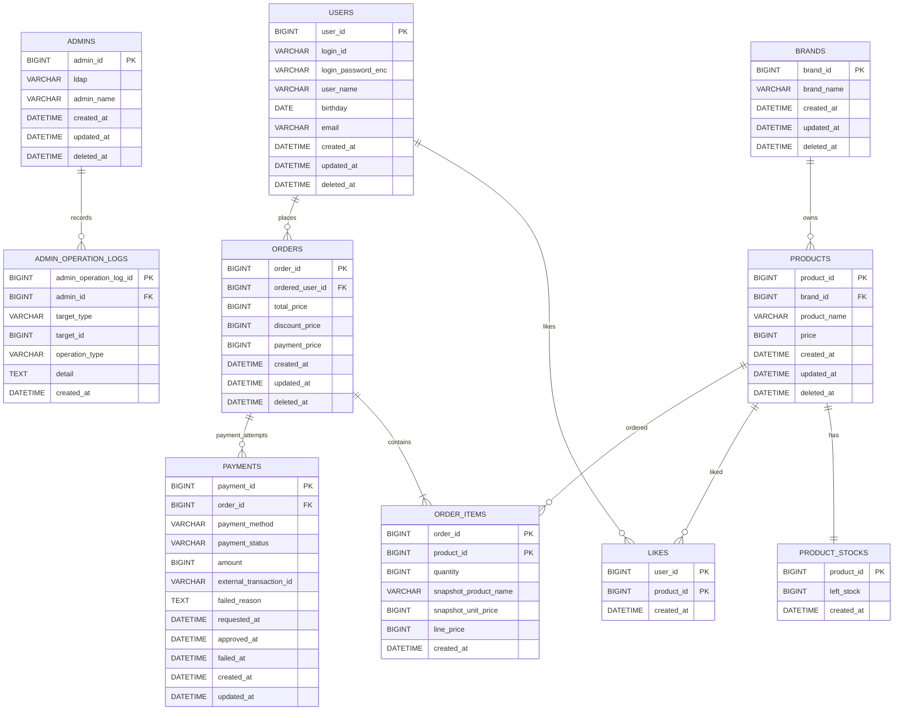

# ERD

## 설계 의도

이 ERD는 `01-requirements.md`의 사용자, 관리자, 브랜드, 상품, 재고, 좋아요, 주문 흐름을 영속성 관점에서 검증하기 위한 문서다.

특히 다음 문제를 확인한다.

- 상품은 등록된 브랜드에만 속하고, 브랜드 삭제 시 소속 상품도 함께 노출에서 제외되는가?
- 좋아요는 사용자와 상품의 유일한 관계 상태로 표현되는가?
- 주문은 주문자, 주문 항목, 재고 차감 대상 상품을 연결하면서도 주문 당시 상품명과 가격 스냅샷을 보존하는가?
- 결제 기록은 주문과 연결되어 결제 수단, 금액, 상태, 외부 거래 식별자를 추적할 수 있는가?
- DB FK와 카디널리티를 명확히 하되, JPA 객체 연관은 불필요하게 양방향으로 열지 않을 수 있는가?

## 기본 정책

- 별도 요구가 없으면 `deleted_at`이 `NULL`이 아닌 행은 삭제된 것으로 간주하는 soft delete를 사용한다.
- 좋아요는 현재 관심 상태만 필요하므로 취소 시 hard delete를 기본으로 둔다.
- ERD의 관계선은 DB FK와 카디널리티를 뜻한다. JPA 객체 그래프의 양방향 매핑을 의미하지 않는다.
- JPA Entity 연관은 기본 단방향으로 시작하고, 컬렉션 탐색이나 cascade 저장이 실제 유스케이스를 단순하게 만들 때만 추가한다.
- 쿠폰은 요구사항상 TBD이므로 별도 테이블로 확정하지 않는다.
- 결제는 결제수단별 상세 정책을 확정하지 않더라도 주문별 결제 시도와 결과 추적을 위해 `payments` 기록 테이블을 둔다.
- outbox 는 현재 ERD에 포함하지 않는다. 결제수단과 외부 연동 방식이 구체화되어 비동기 승인, 재시도, 이벤트 발행 안정성이 필요해지면 `outbox_events` 테이블을 추가한다.

## Mermaid ERD

## 관계 해석

- `products.brand_id`는 상품이 반드시 하나의 브랜드에 속한다는 요구사항을 표현한다. 브랜드 삭제 시 DB cascade 대신 애플리케이션에서 브랜드와 상품을 함께 soft delete한다.
- `product_stocks.product_id`는 상품과 재고의 1:1 관계를 표현한다. 재고 생명주기는 상품에 종속되므로 별도 `deleted_at`을 두지 않고, 재고 차감 근거는 주문 항목으로 추적한다.
- `likes`는 `(user_id, product_id)` 복합 PK로 한 사용자가 한 상품에 좋아요를 한 번만 누를 수 있게 한다. 반복 `POST`는 이미 존재하는 행을 현재 상태로 보고 성공 처리하고, 반복 `DELETE`는 삭제할 행이 없어도 성공 처리한다.
- `order_items`는 `(order_id, product_id)` 복합 PK로 한 주문 안의 동일 상품을 하나의 항목으로 합산한다. 주문 당시 상품명과 단가를 스냅샷 컬럼에 보관해 이후 상품 정보 변경이나 soft delete와 독립적으로 과거 주문 내역을 유지한다.
- `payments`는 주문별 결제 시도와 결과를 기록한다. 결제 재시도나 결제수단 변경을 허용할 수 있도록 주문과 1:N 관계로 둔다. 현재 유효한 결제 상태는 주문의 최신 결제 기록 또는 승인된 결제 기록으로 판단한다.
- `admin_operation_logs`는 관리자 변경 작업만 기록한다. `target_type`은 `BRAND` 또는 `PRODUCT`, `operation_type`은 `CREATED`, `UPDATED`, `DELETED`를 기준으로 한다.

## 주요 제약과 인덱스 후보

| 대상 | 제약/인덱스 | 이유 |
| --- | --- | --- |
| `users.login_id` | unique | 로그인 ID 시스템 전체 유일성 보장 |
| `admins.ldap` | unique | 관리자 LDAP 식별자 중복 방지 |
| `likes(user_id, product_id)` | primary key | 좋아요 멱등성과 중복 방지 |
| `order_items(order_id, product_id)` | primary key | 주문 내 동일 상품 항목 중복 방지 |
| `payments(order_id, created_at)` | index | 주문별 결제 시도 최신 상태 조회 |
| `payments(external_transaction_id)` | unique nullable | 외부 결제 거래 중복 반영 방지 |
| `products(brand_id, created_at)` | index | 브랜드 필터와 최신순 상품 목록 조회 |
| `orders(ordered_user_id, created_at)` | index | 사용자의 주문 기간 조회 |
| `product_stocks(product_id)` | primary key | 주문 시 재고 행 단건 잠금/갱신 기준 |
| `admin_operation_logs(admin_id, created_at)` | index | 관리자별 변경 작업 이력 조회 |
| `admin_operation_logs(target_type, target_id, created_at)` | index | 특정 브랜드/상품 변경 이력 조회 |

## JPA 매핑 방향

DB 관계는 FK로 표현하지만, JPA에서는 다음처럼 단방향을 기본값으로 둔다.

| 관계 | JPA 기본 방향 | 비고 |
| --- | --- | --- |
| 상품 - 브랜드 | `ProductJpaEntity -> BrandJpaEntity` | 상품 등록/조회 시 브랜드 검증에 필요 |
| 재고 - 상품 | `ProductStockJpaEntity -> ProductJpaEntity` 또는 `productId` 값 보관 | shared PK라 단순 ID 매핑도 가능 |
| 좋아요 - 사용자/상품 | `LikeJpaEntity -> UserJpaEntity`, `LikeJpaEntity -> ProductJpaEntity` | 사용자나 상품에서 likes 컬렉션을 열 필요는 낮음 |
| 주문 - 사용자 | `OrderJpaEntity -> UserJpaEntity` | 주문자 식별과 본인 자원 검증에 필요 |
| 주문 항목 - 주문/상품 | `OrderItemJpaEntity -> OrderJpaEntity`, `OrderItemJpaEntity -> ProductJpaEntity` 또는 ID 값 보관 | 주문 상세 조회는 query/fetch join으로 해결 가능 |
| 결제 - 주문 | `PaymentJpaEntity -> OrderJpaEntity` 또는 `orderId` 값 보관 | 결제 기록은 주문별 이력 조회가 핵심이라 단순 ID 매핑도 가능 |
| 관리자 변경 로그 - 관리자 | `AdminOperationLogJpaEntity -> AdminJpaEntity` | 관리자에서 로그 컬렉션을 열 필요는 낮음 |

주문 생성 저장에서 `OrderJpaEntity.items` 컬렉션과 cascade가 구현을 크게 단순화한다면 주문 - 주문 항목만 예외적으로 컬렉션을 열 수 있다. 이 경우에도 도메인 모델과 JPA Entity는 분리하고, 양방향 동기화 책임은 JPA Entity 내부 helper로 제한한다.

## 잠재 리스크

- soft delete를 쓰면 FK cascade만으로 브랜드 삭제 요구사항을 만족할 수 없다. 브랜드 삭제 유스케이스에서 소속 상품을 함께 soft delete하고, 재고 노출 여부는 상품 삭제 상태를 기준으로 판단해야 한다.
- 현재 설계는 `orders.status`를 두지 않고 주문 row와 결제 기록을 함께 보아 주문 결과를 판단한다. 주문 대기, 취소, 환불 같은 상태 전이 정책이 확정되면 `orders.status`와 상태 전이 정책을 추가해야 한다.
- 재고 차감 근거는 주문 항목으로 추적한다. 입고, 수동 보정, 재고 실사처럼 주문 외 재고 변경이 필요해지면 별도 `stock_movements` 이력 테이블을 추가해야 한다.
- 좋아요 hard delete는 이력 분석 요구가 생기면 부족하다. 좋아요 변경 이력이 필요해지면 `likes`에 `deleted_at`을 두거나 별도 이벤트/히스토리 테이블을 추가해야 한다.
- `order_items.product_id` FK는 상품 hard delete와 충돌한다. 과거 주문 스냅샷 보존을 위해 상품은 soft delete를 유지하는 편이 안전하다.
- 외부 결제 호출은 DB 트랜잭션 밖에서 수행한다. TX1 (주문·재고·결제 요청 기록) 커밋 이후 TX2 (결제 결과 반영, 실패 시 재고 보상) 도달 전에 프로세스가 종료되면 `payments.status = REQUESTED` 미결 상태가 남는다. 미결 결제 회수(상태 폴링·웹훅 수신·운영자 보정)와 외부 연동 안정성이 요구되면 outbox 패턴을 별도 테이블로 추가한다.
- `admin_operation_logs.target_id`는 브랜드와 상품을 함께 가리키는 다형 참조라 DB FK를 강제하지 않는다. Facade가 변경 대상 검증과 저장 성공을 확인한 뒤 로그를 기록해야 하며, 대상별 무결성이나 변경 전/후 값 감사가 필요해지면 로그 detail 형식을 JSON/TEXT 스냅샷으로 구체화해야 한다.
- `likes_desc` 정렬을 대량 트래픽에서 안정적으로 제공해야 하면 실시간 집계 조인 대신 상품별 좋아요 수 캐시 컬럼이나 집계 테이블을 검토해야 한다.
